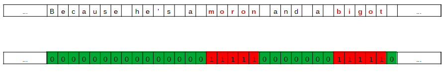

# wawunet_for_toxicspan
wawunet for SemEval-2021 Task 5: Toxic Spans Detection

SemEval-2021 Task 5: Toxic Spans Detection. Our approach considers toxic spans detection as a segmentation problem. The system, Waw-unet, consists of a 1-D convolutional neural network adopted from U-Net architecture commonly applied for semantic segmentation. We customize existing architecture by adding a special network block considering for text segmentation, as an essential
component of the model. 

