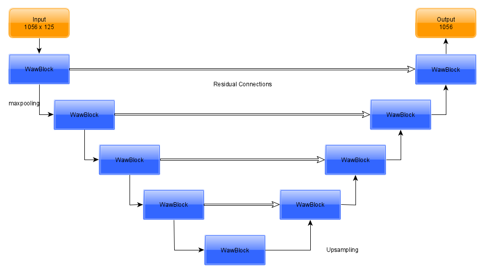

# WawUnet
Waw-unet is a fully convolutional neural network
architecture we designed by taking inspiration from
U-Net architecture 

Waw-unet takes input samples—in our case,
text—and generates homogeneous masked regions
for the targeted segment.

Although its architecture adapted from U-Net,
we customize existing architecture by adding a special network block for text segmentation, as an
essential component of the model. Waw-unet uses
a special network block—we call it Waw-blok—to
extract the attributes in the targeted text patterns.
In our architecture, each waw-block contains three
convolutional layers with different kernel sizes.
Waw-unet learns input features through filter sizes
of the 3, 5, and 7 as shown in Fig

 In
accordance with the segmentation logic, the output
character positions contain toxic spans masked as
1 and the other parts of the text masked as 0

